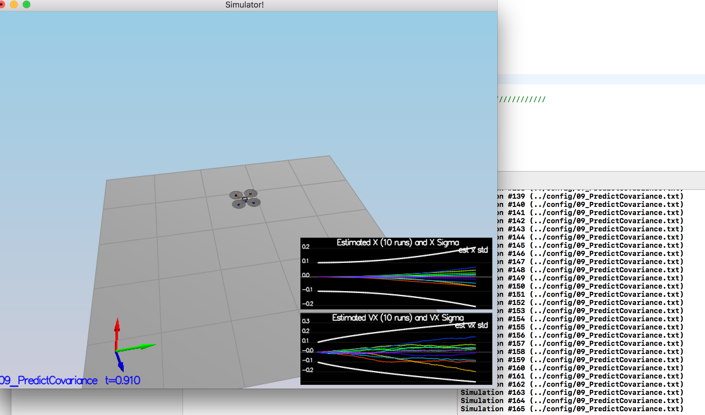

# Estimation Project #


## The Tasks ##

Once again, you will be building up your estimator in pieces.  At each step, there will be a set of success criteria that will be displayed both in the plots and in the terminal output to help you along the way.

Project outline:

 - [Step 1: Sensor Noise](#step-1-sensor-noise)
 - [Step 2: Attitude Estimation](#step-2-attitude-estimation)
 - [Step 3: Prediction Step](#step-3-prediction-step)
 - [Step 4: Magnetometer Update](#step-4-magnetometer-update)
 - [Step 5: Closed Loop + GPS Update](#step-5-closed-loop--gps-update)
 - [Step 6: Adding Your Controller](#step-6-adding-your-controller)


### Step 1: Sensor Noise ###

For the controls project, the simulator was working with a perfect set of sensors, meaning none of the sensors had any noise.  The first step to adding additional realism to the problem, and developing an estimator, is adding noise to the quad's sensors.  For the first step, you will collect some simulated noisy sensor data and estimate the standard deviation of the quad's sensor.

- use pandas to process the logged files to figure out the standard deviation of the the GPS X signal and the IMU Accelerometer X signal.
- tune `MeasuredStdDev_GPSPosXY` and `MeasuredStdDev_AccelXY` in `config/6_Sensornoise.txt`:
```
MeasuredStdDev_GPSPosXY = 0.708427
MeasuredStdDev_AccelXY = 0.513524
```
- the picture of result:


### Step 2: Attitude Estimation ###

Now let's look at the first step to our state estimation: including information from our IMU.  In this step, you will be improving the complementary filter-type attitude filter with a better rate gyro attitude integration scheme.

- implement the code in the function [`UpdateFromIMU()`](src/QuadEstimatorEKF.cpp#L74-L120):
use `FromEuler123_RPY` and `IntegrateBodyRate` to collect all information about attitude

- the picture of result:


In the screenshot above the attitude estimation using linear scheme (left) and using the improved nonlinear scheme (right). Note that Y axis on error is much greater on left.

***Success criteria:*** *Your attitude estimator needs to get within 0.1 rad for each of the Euler angles for at least 3 seconds.*

**Hint: see section 7.1.2 of [Estimation for Quadrotors](https://www.overleaf.com/read/vymfngphcccj) for a refresher on a good non-linear complimentary filter for attitude using quaternions.**


### Step 3: Prediction Step ###

In this next step you will be implementing the prediction step of your filter.
#### scenario `08_PredictState`

- implement the code in the function [`PredictState()`](src/QuadEstimatorEKF.cpp#L145-L182)
- the picture of result:


#### scenario `09_PredictionCov`

- implement the code in the function [`GetRbgPrime()`](src/QuadEstimatorEKF.cpp#184-233)
- implement the code in the function [`Predict()`](src/QuadEstimatorEKF.cpp#L145-L182)



**Hint: see section 7.2 of [Estimation for Quadrotors](https://www.overleaf.com/read/vymfngphcccj) for a refresher on the the transition model and the partial derivatives you may need**

**Hint: When it comes to writing the function for GetRbgPrime, make sure to triple check you've set all the correct parts of the matrix.**

**Hint: recall that the control input is the acceleration!**


### Step 4: Magnetometer Update ###

Up until now we've only used the accelerometer and gyro for our state estimation.  In this step, you will be adding the information from the magnetometer to improve your filter's performance in estimating the vehicle's heading.


- Tune the parameter `QYawStd` (`QuadEstimatorEKF.txt`)

`QYawStd = .1`
- implement the code in the function [`UpdateFromMag()`](src/QuadEstimatorEKF.cpp#L305-L339)

- the picture of result:


***Success criteria:*** *Your goal is to both have an estimated standard deviation that accurately captures the error and maintain an error of less than 0.1rad in heading for at least 10 seconds of the simulation.*

**Hint: after implementing the magnetometer update, you may have to once again tune the parameter `QYawStd` to better balance between the long term drift and short-time noise from the magnetometer.**

**Hint: see section 7.3.2 of [Estimation for Quadrotors](https://www.overleaf.com/read/vymfngphcccj) for a refresher on the magnetometer update.**


### Step 5: Closed Loop + GPS Update ###

- Tune the parameter in `11_GPSUpdate.txt`

```
Quad.UseIdealEstimator = 0
#SimIMU.AccelStd = 0,0,0
#SimIMU.GyroStd = 0,0,0
```

- implement the code in the function [`UpdateFromGPS()`](src/QuadEstimatorEKF.cpp#L281-L307)

- the picture of result:


***Success criteria:*** *Your objective is to complete the entire simulation cycle with estimated position error of < 1m.*

**Hint: see section 7.3.1 of [Estimation for Quadrotors](https://www.overleaf.com/read/vymfngphcccj) for a refresher on the GPS update.**

At this point, congratulations on having a working estimator!

### Step 6: Adding Your Controller ###

- the picture of result:


**Hint: you may find it easiest to do your de-tuning as a 2 step process by reverting to ideal sensors and de-tuning under those conditions first.**

***Success criteria:*** *Your objective is to complete the entire simulation cycle with estimated position error of < 1m.*
